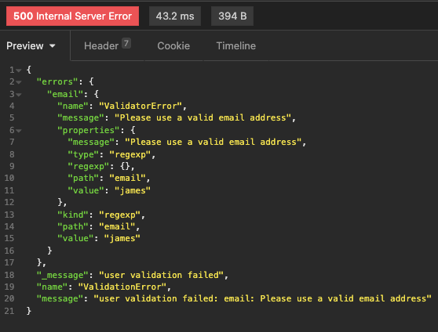
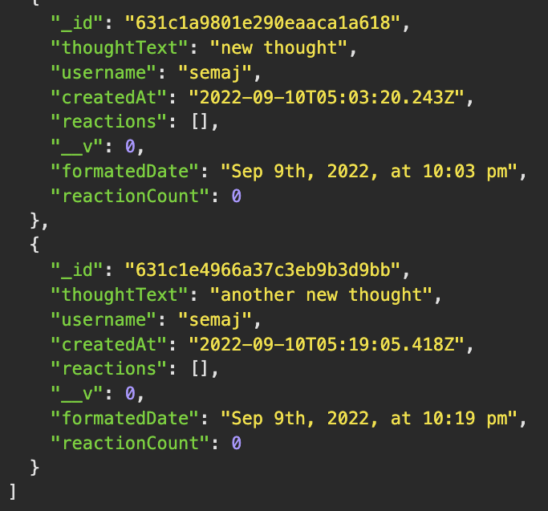

# NoSQL: Social Network API

  ## Description

  This an API for a social network web application where users can share their thoughts, react to friends’ thoughts, and create a friend list 

  ## Video Recording
  [WALK-THROUGH VIDEO](https://drive.google.com/drive/folders/1eBZAD336dVGj7XKMfhvl_BHAKF--iBR-?usp=sharing)

  ## Screenshots:
  
  

  ## Table of Contents
  #### [Installation](#installation)
  #### [Usage](#usage)
  #### [Contribution](#contribution)
  #### [License](#license)
  #### [Contact](#questions)

  ## Installation

  - On your terminal, run command 'node index.js'.

  ## Usage
  - GET, POST, PUT, and DELETE test through 'insomnia'
    - User routes:
      - http://localhost:3001/api/users/
      - http://localhost:3001/api/users/:userId
    - Friend routes:
      - http://localhost:3001/api/users/:userId/friends/:friendId
    - Thought routes:
      - http://localhost:3001/api/thoughts/
      - http://localhost:3001/api/thoughts/:thoughtsId
    - Reaction routes:
      - http://localhost:3001/api/thoughts/:thoughtsId/:thoughtId/reactions
      - http://localhost:3001/api/thoughts/:thoughtsId/:thoughtId/reactions:reactionId
    
  ## Contribution

  - Submit a pull request

  ## License

  

  ## Questions?

  Github: [fyerra](https://github.com/fyerra)
  E-mail: frankyerra1@gmail.com